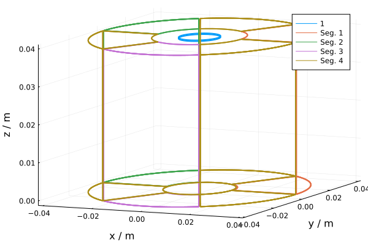
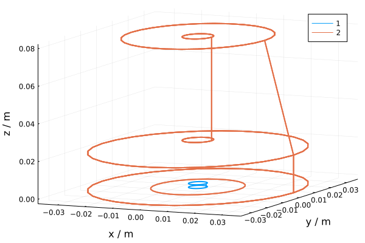
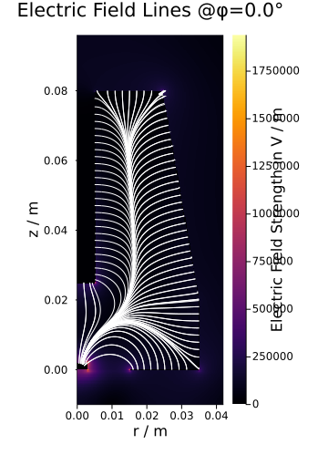

# Detector study
 
## 1. Detector geometry

### 1.1 SolidStateDetectors recap

We can use SSD simply to **visualize detector geometry** (even if we're planning to use Fieldgen for simulation later)

```julia
using SolidStateDetectors
using Plots
plotlyjs(); # backend for interactive plots (Jupyter)
```

SSD detector configuration file defines geometrical objects and their combinations. You can open one and scroll through, you'll see a bunch of tubes and cones.

```julia
# path to detector configuration JSON included in SSD examples
det_config_json = SSD_examples[:BEGe]
[Output] "/.../.julia/packages/SolidStateDetectors/.../examples/example_detector_config_files/public_SegBEGe_config.json"
```

This is not yet a simulation, ONLY the geometry (note all the "missing" in the output)

```julia
simulation = Simulation{Float32}(det_config_json)
[Output] 
Simulation{Float32} - Coordinate system: cylindrical
  Detector: Public Inverted Coax
  Electric potential: missing
  Charge density: missing
  Fix Charge density: missing
  Dielectric distribution: missing
  Point types: missing
  Electric field: missing
  Weighting potentials: 
    Contact 1: missing
    Contact 2: missing
  Charge drift model: missing
  Electron drift field: missing
  Hole drift field: missing
```

```
plot(simulation.detector)
```



### 1.2. LEGEND detector metadata

LEGEND detectors are described in metadata JSON files. They contain information about geometry, manufacturer, and more. LegendGeSim allows us to construct an SSD configuration with its tubes and cones and stuff based on detector metadata json. In this example, I will use `invcoax-metadata.json` from the `legend-testdata` respository on `legend-exp` (not a real LEGEND detector).


### LEGEND test data (skip if you use your own detector metadata JSON)
To access `legend-testdata`, use the `LegendTestData.jl` package.
Install and build the package (do once)
```julia
import Pkg
Pkg.add(url="https://github.com/legend-exp/LegendTestData.jl.git")
Pkg.build("LegendTestData")
```
Get path to test data for LegendGeSim
```julia
using LegendTestData
testdata_path = joinpath(LegendTestData.legend_test_data_path(), "data", "ldsim")
```
### Detector geometry

```julia
using LegendGeSim
```

```julia
# path to my detector metadata
det_metadata = joinpath(testdata_path, "invcoax-metadata.json")
# convert LEGEND metadata to SSD configuration (only geometry!)
det_config_ssd = LegendGeSim.ssd_config(det_metadata)
# now we can plug it into SSD
simulation1 = Simulation(SolidStateDetector{Float32}(det_config_ssd))
plot(simulation1.detector)
```



<span style="color:red"> **NOTE: not all geometries are implemented yet!** </span>

If your output does not look like what you expected, notify Mariia Redchuk.

Currently not implemented: inner taper (borehole), outer bottom taper.

## 2. Detector simulation

In order to simulate the detector, in addition to its geometry we also need information about the **environment** and the **simulation method** (SSD or Fieldgen). Both are provided to LegendGeSim via **"simulation configuration"** JSON. Examples of sim configs for detector simulation only (without PSS) can be be found in `configs/detector_study*.json`.


<span style="color:red"> **NOTE: IMPURITY PROFILE not yet implemented!** </span>

I don't know how to translate the one in LEGEND metadata to SSD and siggen. Working on it.

In the following sections I will explain the fields in this JSON and give examples.

### 2.1. Environment

Environment variables are provided in the LegendGeSim simulation config JSON file in the following way: 

```json
"environment":{
		"crystal_t": 90.0, 
		"op_voltage": 4000, 
		"medium": "vacuum"
}
```

`crystal_t`: temperature in K
`op_voltage`: operating (not depletion) voltage in V
`medium`: "vacuum" or emm "LAr"? I don't know the keyword, ask the SSD people please. This parameter only makes a difference for SSD, not sure yet which siggen parameter corresponds to this, if any.

### 2.2. Simulation method

#### 2.2.1. SolidStateDetectors

```json
"simulation":{
	"method": "SSD",
	"cached_name": "vacuum_90K_4000V"
}
```

`cached_name` is a "suffix" for cached simulation files (in case of SSD, a detector simulation h5 file). The suffix is added to the name of the detector metadata file. For example, if you use `invcoax-metadata.json`, the cached name in this case will be `cache/invcoax-metadata_vacuum_90K_4000V_ssd.h5f`. If `cached_name` is not provided, the name of the simulation settings JSON will be used as "suffix". If SSD finds an h5 file with the given suffix in `cache/`, it will read it instead of launching the simulation from scratch.

Putting environment and simulation settings together in `configs/detector_study_ssd.json`, we can now launch detector simulation.

```julia
detector = LegendGeSim.simulate_detector(det_metadata, "configs/detector_study_ssd.json")
```
The function returns a `SolidStateDetectors.Simulation` object. Now we can use SSD functions to calculate capacitance...
```julia
calculate_capacitance(detector)
[Output] 13.9318698772083 pF
```
...and check active volume...
```julia
get_active_volume(detector.point_types)
[Output] 237.93901f0 cm^3
```
...as well as plot stuff
```julia
plot(detector.electric_field, φ = 0.0)
plot_electric_fieldlines!(detector, φ = 0.0)
```



You can learn how to make more different kinds of plots in the SolidStateDetectors Tutorial
https://juliaphysics.github.io/SolidStateDetectors.jl/stable/tutorial/


#### 2.2.2. Fieldgen

Fieldgen is written in C and uses its own simulation settings format which looks like this:

```
# detector geometry
xtal_length    80    # z length
xtal_radius    35    # radius
pc_length      2.0   # point contact length
pc_radius      3.0   # point contact radius
...

# configuration for signal calculation
xtal_temp         90       # crystal temperature in Kelvin
time_steps_calc   40000    # max. number of time steps used in calculations
step_time_calc    0.1      # length of time step used for calculation, in ns
step_time_out     1.0      # length of time step for output signal, in ns
...
```

This is a single configuration file for **both Fieldgen** (detector simulation) and **Siggen** (waveform simulation).

Guess what, LegendGeSim can also construct a Fieldgen/Siggen configuration file based on given LEGEND metadata, environment information and simulation settings. It needs some extra inputs as well:

```json
"simulation":{
    "method": "fieldgen",
    "fieldgen_config": "configs/fieldgen_settings.txt", # extra input that is not in metadata or environment
    "drift_vel": "configs/drift_vel_tcorr.tab", # I don't know what this is and why it's necessary
    "cached_name": "vacuum_90K_4000V"
}
```

Note: future TODO is to get rid of the extra `fieldgen_settings.txt` file, and move all necessary settings into LegendGeSim JSON (one config to rule them all)

The command to call the Fieldgen simulation is **identical** to the one for SSD, what matters are the settings inside the simulation config JSON file as demonstrated above. Combining environment and simulation settings in `configs/detector_study_fieldgen.json`, we can launch the simulation.

```julia
detector = LegendGeSim.simulate_detector(det_metadata, "configs/detector_study_fieldgen.json")
```
The function returns an `MJDSigGen.SigGenSetup` object.
Now, if you scroll through fieldgen output messages, you will see

```
 >>  Calculated capacitance at 4000 V: 3.256 pF
 >>  Alternative calculation of capacitance: 3.217 pF
```

TODO
1) Write a function to extract capacitance from Fieldgen output or the SigGenSetup object (if saved there)
2) Write a function to plot the WP and EV dat files created by fieldgen &rarr; Tommaso already has it, only need to add to `MJDSigGen.jl` (which is used in `LegendGeSim.jl`)


## Extra

Additional arguments under `"simulation"` in the sim config 
- `"coordinates": "cartesian"` will enable cartesian grid (default `"cylindrical"`)
- `"computation" : "2D"` (default) implies phi symmetry. Set to `"3D"` for full simulation. Only applies to the case of cylindrical coordinates. You should see `φ symmetry: Detector is φ-symmetric -> 2D computation` in SSD log.