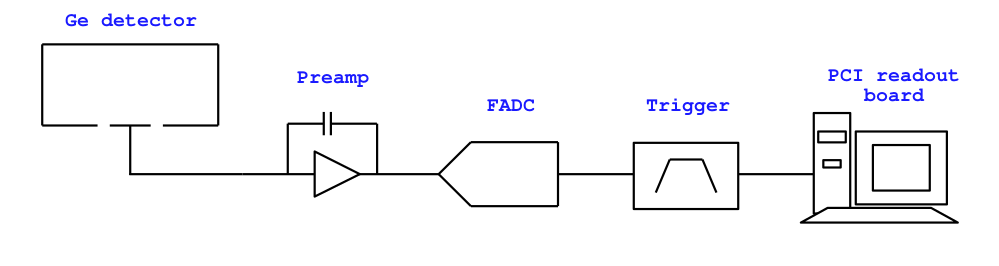
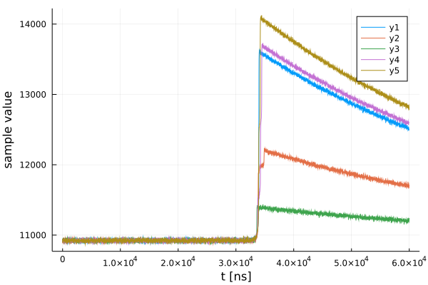
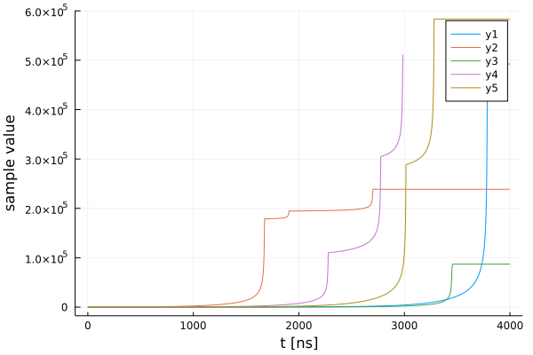

# Pulse Shape Simulation

## Intro

The data processing flow is `daq->raw->dsp->hit->evt`. The purpose of LegendGeSim is to mimic the `raw` tier, and let the data processing do the rest.
 
For this we need:
 
* **events that generate them**
* **detector geometry**
* **simulation configuration**

The main PSS function is called `simulate_raw` and it takes these three things as input. Throughout this example I call the first two **"simulation inputs"**, as opposed to **"simulation config"**.

Let's first understand what these are and then I promise I'll just skip to examples.


## Input events

For this example, I am using a **"Geant4 CSV"** input which has the following format
```
#class tools::wcsv::ntuple
#title Energy and time
#separator 44
#vector_separator 59
#column double Event#
#column double Detector_ID
#column double Time
#column double EnergyDeposit
#column double X
#column double Y
#column double Z
2,0,1.43614e+17,21.2139,-3.90233,-6.015619999999999,79.9605
2,0,1.43614e+17,20.7303,-3.89951,-6.04073,79.9306
2,0,1.43614e+17,23.0853,-3.87895,-6.0519,79.8946
2,0,1.43614e+17,15.2583,-3.86079,-6.0345,79.8692
...
```

The path to this file is the first variable in `simulate_raw`.

You can also use **g4simple hdf5**, for example, the ones in the HADES simulations directory. I'm not using it not to put non-public information on GitHub.

Note on the units: position [mm], time [ns], energy [**keV** for csv, **MeV** in g4simple].

At least for now, these events must be provided for a **single detector**, meaning, if you have different detector IDs in there, LegendGeSim will ignore that and assume all events belong to the detector the geometry of which you provide as input.


## Detector geometry

Detector geometry should be provided in the **LEGEND metadata** format. LegendGeSim will convert it to SSD or siggen/fieldgen configuration for you.
The path to the metadata JSON file is the second variable in `simulate_raw`.

## Simulation config

Now this is the thickest section.

**"Simulation config"** is a JSON file with a specific format, the path to which is the third and final variable of `simulate_raw`.

Example settings can be found in `configs`. I will take `configs/SSD_NoiseSim.json` and break it down.

### Environment settings

```json
 "environment":{
        "crystal_t": 90.0,
        "op_voltage": 4000,
        "medium": "vacuum"
    }
```

`crystal_t`: temperature in K
`op_voltage`: operating (not depletion) voltage in V
`medium`: "vacuum" or emm "LAr"? I don't know the keyword, ask the SSD people please. This parameter only makes a difference for SSD, not sure yet which siggen parameter corresponds to this, if any.

### Simulation method

In this example, we are using SolidStateDetectors. In case of siggen there are additional fields for some files with siggen/fieldgen settings (see `configs/`)

```json
"simulation":{
        "method": "SSD",
        "cached_name": "vacuum_90K_4000V"
    }
```
 
`cached_name` is a "suffix" for cached simulation files (in case of SSD, a detector simulation h5 file). The suffix is added to the name of the detector metadata file. For example, if you use `data/public_ivc.json`, the cached name in this case will be `cache/public_ivc_vacuum_90K_4000V_ssd.h5f`. If `cached_name` is not provided, the name of the simulation settings JSON will be used as "suffix".  If SSD finds an h5 file with the given suffix in `cache/`, it will read it instead of launching the simulation from scratch.

### Setup

Parameters of components of the specific setup. Currently only one dummy setup is available:



Preamp, FADC and Trigger parameters are all defined in the "setup" section of the JSON.

```json
    "setup":{
        "preamp":{
            "t_decay":50, # ns
            "t_rise":15, # ns
            "noise_sigma":3, # keV
            "max_e": 10000, # keV
            "offset": 2000 # keV
        },
        "fadc":{
            "type": "generic",
            "sampling_interval": 16 # ns
        },
        "trigger":{
            "type": "trapezoidal",        
            "window_lengths": [250,250,250], # in number of samples
            "threshold": 9 # keV
        },
        "daq": {
            "type": "generic",
            "nsamples": 3750,
            "baseline_length": 1875
        }
    }
```
As you can see, this is all very dummy, I don't think trigger threshold should be provided in keV (here it's simply 3 x `noise_sigma` in keV btw)

For FADC, one can provide `sampling_rate` in  MHz, or `sampling_interval` in ns (sometimes it's more convenient for the simulation).

The "daq" field specifies how many samples are saved and how much baseline is added. I didn't know which physical component these decisions belong to, so for now it's just "daq".

Let's go to the promised examples.

## Example

```julia
using LegendGeSim
```
```julia
# PET (position-energy-time) information of the simulated energy depositions
pet_filename = "data/dual-invcoax-th228-geant4_singledet_small.csv"
# detector
det_metadata = "data/public_ivc.json"
# simulation settings
sim_config_name = "configs/SSD_NoiseSim.json"
```
```julia
raw_table = LegendGeSim.simulate_raw(pet_filename, det_metadata, sim_config_name)
```

You should get a lot of funky output and in the end a table like this:

```julia
Table with 11 columns and 240 rows:
      baseline  channel  energy       ievt  numtraces  packet_id  timestamp     tracelist  waveform                                                             wf_max  wf_std
    ┌──────────────────────────────────────────────────────────────────────────────────────────────────────────────────────────────────────────────────────────────────────────
 1  │ 10922.7   1        472.19 keV   2     1.0        0.0        1.43614f17 s  [1]        RDWaveform{Quantity{Float64, 𝐓, FreeUnits{(ns,), 𝐓, nothing}}, UIn…  13638   1056.85
 2  │ 10922.5   1        225.473 keV  7     1.0        0.0        1.43614f17 s  [1]        RDWaveform{Quantity{Float64, 𝐓, FreeUnits{(ns,), 𝐓, nothing}}, UIn…  12238   508.787
 3  │ 10922.7   1        83.3682 keV  12    1.0        0.0        1.43614f17 s  [1]        RDWaveform{Quantity{Float64, 𝐓, FreeUnits{(ns,), 𝐓, nothing}}, UIn…  11437   187.697
 4  │ 10921.7   1        487.822 keV  13    1.0        0.0        1.43614f17 s  [1]        RDWaveform{Quantity{Float64, 𝐓, FreeUnits{(ns,), 𝐓, nothing}}, UIn…  13730   1090.93
 5  │ 10922.2   1        557.534 keV  17    1.0        0.0        1.43614f17 s  [1]        RDWaveform{Quantity{Float64, 𝐓, FreeUnits{(ns,), 𝐓, nothing}}, UIn…  14125   1248.52
 6  │ 10922.3   1        228.707 keV  40    1.0        0.0        1.43614f17 s  [1]        RDWaveform{Quantity{Float64, 𝐓, FreeUnits{(ns,), 𝐓, nothing}}, UIn…  12244   511.149
 7  │ 10922.8   1        2494.11 keV  44    1.0        0.0        1.43614f17 s  [1]        RDWaveform{Quantity{Float64, 𝐓, FreeUnits{(ns,), 𝐓, nothing}}, UIn…  25084   5606.62
 8  │ 10922.7   1        341.609 keV  55    1.0        0.0        1.43614f17 s  [1]        RDWaveform{Quantity{Float64, 𝐓, FreeUnits{(ns,), 𝐓, nothing}}, UIn…  12888   765.089
 9  │ 10922.8   1        91.4549 keV  62    1.0        0.0        1.43614f17 s  [1]        RDWaveform{Quantity{Float64, 𝐓, FreeUnits{(ns,), 𝐓, nothing}}, UIn…  11506   204.909
 10 │ 10922.4   1        228.839 keV  64    1.0        0.0        1.43614f17 s  [1]        RDWaveform{Quantity{Float64, 𝐓, FreeUnits{(ns,), 𝐓, nothing}}, UIn…  12253   512.278
 11 │ 10921.6   1        2503.74 keV  95    1.0        0.0        1.43614f17 s  [1]        RDWaveform{Quantity{Float64, 𝐓, FreeUnits{(ns,), 𝐓, nothing}}, UIn…  25133   5608.05
 12 │ 10922.5   1        74.3244 keV  102   1.0        0.0        6.5448f16 s   [1]        RDWaveform{Quantity{Float64, 𝐓, FreeUnits{(ns,), 𝐓, nothing}}, UIn…  11389   166.992
 ⋮  │    ⋮         ⋮          ⋮        ⋮        ⋮          ⋮           ⋮            ⋮                                       ⋮                                     ⋮        ⋮
```

```julia
using Plots
```
```julia
plot(raw_table.waveform[1:5])
```



Tadah!

You can save the output table like this:

```julia
using HDF5
using LegendHDF5IO
```
```
HDF5.h5open("output/my_name_raw.h5", "w") do f
    LegendHDF5IO.writedata(f, "raw", raw_table)
end
```

## Advanced 

---

The simulation flow is `pet->stp->pss->raw`.

`pet` : **position-energy-time** information, your input

`stp` : "**stepping information**", an intermediate step to prepare and clean up `pet` (clustering, remove events outside of the detector etc)

`pss` : **pulse shape simulation**, resulting in ideal pulses that come out of SSD/siggen.

`raw` : **data-like waveforms**, after the simulation of the DAQ setup.

In some cases, it might be useful to save all or some of these for later, to avoid redoing the same steps again and again, if you're only intersted in re-running the latter ones.

### `pet -> stp`

Using the same variables as defined above (note: simulation settings not needed at this stage).

```julia
stp_table = LegendGeSim.pet_to_stp(pet_filename, det_metadata)
```
```julia
Table with 5 columns and 120 rows:
      evtno  detno  thit                                                edep                                                pos
    ┌─────────────────────────────────────────────────────────────────────────────────────────────────────────────────────────────────────────────────────────────────────────
 1  │ 2      0      Unitful.Quantity{Float32, 𝐓, Unitful.FreeUnits{(s…  Unitful.Quantity{Float32, 𝐋^2 𝐌 𝐓^-2, Unitful.Fre…  StaticArrays.SVector{3, Unitful.Quantity{Float32,…
 2  │ 7      0      Unitful.Quantity{Float32, 𝐓, Unitful.FreeUnits{(s…  Unitful.Quantity{Float32, 𝐋^2 𝐌 𝐓^-2, Unitful.Fre…  StaticArrays.SVector{3, Unitful.Quantity{Float32,…
 3  │ 12     0      Unitful.Quantity{Float32, 𝐓, Unitful.FreeUnits{(s…  Unitful.Quantity{Float32, 𝐋^2 𝐌 𝐓^-2, Unitful.Fre…  StaticArrays.SVector{3, Unitful.Quantity{Float32,…
 4  │ 13     0      Unitful.Quantity{Float32, 𝐓, Unitful.FreeUnits{(s…  Unitful.Quantity{Float32, 𝐋^2 𝐌 𝐓^-2, Unitful.Fre…  StaticArrays.SVector{3, Unitful.Quantity{Float32,…
 5  │ 17     0      Unitful.Quantity{Float32, 𝐓, Unitful.FreeUnits{(s…  Unitful.Quantity{Float32, 𝐋^2 𝐌 𝐓^-2, Unitful.Fre…  StaticArrays.SVector{3, Unitful.Quantity{Float32,…
 6  │ 40     0      Unitful.Quantity{Float32, 𝐓, Unitful.FreeUnits{(s…  Unitful.Quantity{Float32, 𝐋^2 𝐌 𝐓^-2, Unitful.Fre…  StaticArrays.SVector{3, Unitful.Quantity{Float32,…
 7  │ 44     0      Unitful.Quantity{Float32, 𝐓, Unitful.FreeUnits{(s…  Unitful.Quantity{Float32, 𝐋^2 𝐌 𝐓^-2, Unitful.Fre…  StaticArrays.SVector{3, Unitful.Quantity{Float32,…
 8  │ 55     0      Unitful.Quantity{Float32, 𝐓, Unitful.FreeUnits{(s…  Unitful.Quantity{Float32, 𝐋^2 𝐌 𝐓^-2, Unitful.Fre…  StaticArrays.SVector{3, Unitful.Quantity{Float32,…
 9  │ 62     0      Unitful.Quantity{Float32, 𝐓, Unitful.FreeUnits{(s…  Unitful.Quantity{Float32, 𝐋^2 𝐌 𝐓^-2, Unitful.Fre…  StaticArrays.SVector{3, Unitful.Quantity{Float32,…
 10 │ 64     0      Unitful.Quantity{Float32, 𝐓, Unitful.FreeUnits{(s…  Unitful.Quantity{Float32, 𝐋^2 𝐌 𝐓^-2, Unitful.Fre…  StaticArrays.SVector{3, Unitful.Quantity{Float32,…
 11 │ 95     0      Unitful.Quantity{Float32, 𝐓, Unitful.FreeUnits{(s…  Unitful.Quantity{Float32, 𝐋^2 𝐌 𝐓^-2, Unitful.Fre…  StaticArrays.SVector{3, Unitful.Quantity{Float32,…
 12 │ 102    0      Unitful.Quantity{Float32, 𝐓, Unitful.FreeUnits{(s…  Unitful.Quantity{Float32, 𝐋^2 𝐌 𝐓^-2, Unitful.Fre…  StaticArrays.SVector{3, Unitful.Quantity{Float32,…
 ⋮  │   ⋮      ⋮                            ⋮                                                   ⋮                                                   ⋮
```

Ok this is not really readable, but basically each `evtno` has one or multiple hits, so `thit` is an array of times, `edep` array of energies, and `pos` array of arrays of (x,y,z)

Save it in a similar way as shown for `raw`

```julia
HDF5.h5open("cache/my_name_stp.h5", "w") do f
    LegendHDF5IO.writedata(f, "stp", stp_table)
end
```

### `stp -> pss`

Let's say you want to simulate ideal pulses based on previously cached stp file.

```julia
pss_table, pss_truth = LegendGeSim.stp_to_pss("cache/my_name_stp.h5", det_metadata, sim_config_name)
```

This time you get two tables in the output, the simulated pulses (`pss_table`) and the input simulation truth (`pss_truth`). For now the truth table is actually the same as the `stp` table, it might be removed in the future. 

You can also launch the same command providing the stp table instead of the path to the cached file, if you loaded it yourself with `HDF5` and `LegendHDF5IO`, or obtained it from `pet_to_stp` earlier.

```julia
pss_table, pss_truth = LegendGeSim.stp_to_pss(stp_table, det_metadata, sim_config_name)
```
Now we can look at the waveforms

```julia
plot_pss = plot(pss_table.waveform[1:5])
```



Similarly, you can save the output for later.

```julia
h5open("cache/my_name_pss.h5", "w") do f
    LegendHDF5IO.writedata(f, "pss/pss", pss_table)
    LegendHDF5IO.writedata(f, "pss/truth", pss_truth)
end
```

### `pss -> raw`

Same as `stp->pss`, you can now simulate `raw` tier based on previously saved `pss`.

```julia
raw_table = LegendGeSim.pss_to_raw("cache/my_name_pss.h5", det_metadata, sim_config_name)
```

or passing it the tables obtained in the previous step

```julia
raw_table = LegendGeSim.pss_to_raw(pss_table, pss_truth, det_metadata, sim_config_name)
```

Note: right now `pss_truth` is needed as input to `pss_to_raw` because the DAQ timestamp is created as simply the truth `thit` of the first hit in the event. Not sure how it will be in the future.

### `pet -> pss`

This might be of interest if you don't care about `stp`, but do want to save `pss` for later to run with different setups or so.

```julia
pss_table, pss_truth = LegendGeSim.pet_to_pss(pet_filename, det_metadata, sim_config_name)
```